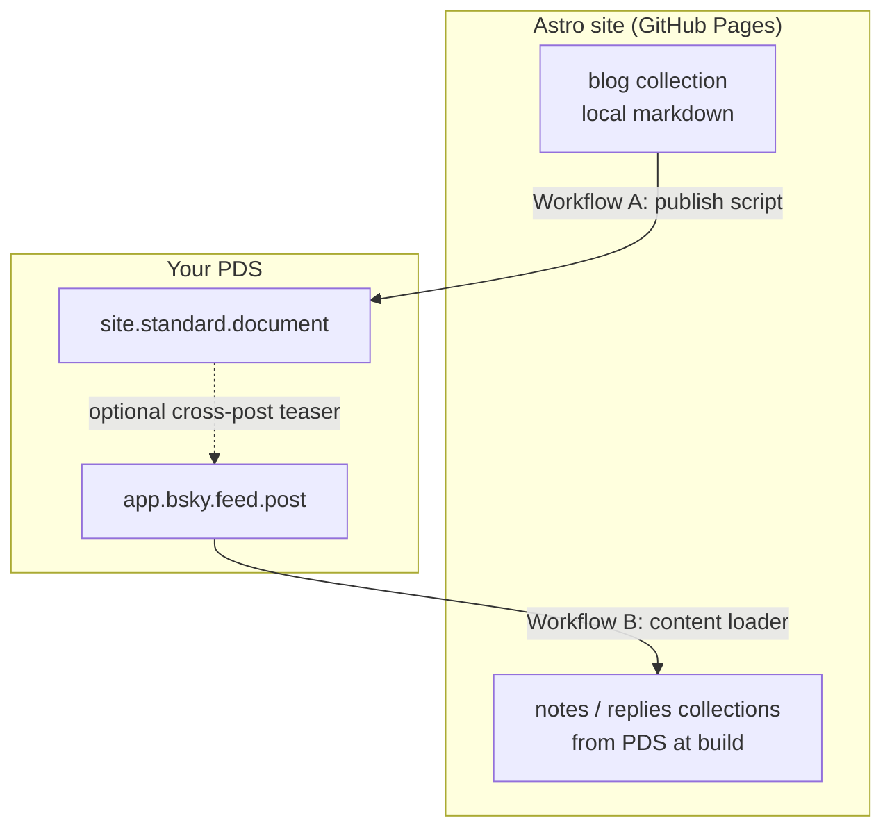

# Astro sites and AT Protocol

Requirements and architecture for connecting **Astro-managed static sites** (GitHub Pages, devx-template shape) to the [ATmosphere](https://atproto.com/) — with [standard.site](https://standard.site/) for long-form publishing and Bluesky (`app.bsky.feed.*`) for social records.

This doc is the source of truth for a future devx preset (scripts, content schemas, CI snippets). It describes what to build, which npm packages to compose, and how the two workflows fit together.

---

## Concepts (60 seconds)

| Term | Meaning |
|------|---------|
| **Handle** | Public name (e.g. `slacktivist.com`) — verified via DNS |
| **DID** | Permanent identity (e.g. `did:plc:…`) |
| **PDS** | Where your records live (for many Bluesky users: Bluesky-hosted, not your web server) |
| **standard.site** | Lexicons for long-form: `site.standard.publication`, `site.standard.document` |
| **Your Astro site** | Static HTML on GitHub Pages — separate from the PDS |

Publishing to the atmosphere means writing **records on your PDS**. The website and the PDS are linked by verification (`.well-known`, `<link>` tags), not by being the same server.

---

## Two workflows

Most devx sites need **Workflow A**. **Workflow B** is optional: surface Bluesky activity on the site without writing everything as markdown first.



### Workflow A — Publish out

**Source of truth:** markdown in the repo.

1. Write posts in Astro (`src/content/blog/` or equivalent).
2. CI (or local) runs a **sync script** → creates/updates `site.standard.document` on your PDS.
3. `astro build` → static site with verification tags and optional federated comments.

Long-form lives on the PDS as standard.site records; images in posts stay on your site as stable URLs (`public/images/…`).

### Workflow B — Ingest in (atmosphere → site)

**Source of truth:** records already on your PDS (Bluesky for now).

1. You post or reply on Bluesky → `app.bsky.feed.post` in **your** repo.
2. At **build time**, a content loader pulls selected records into Astro collections.
3. Static pages render notes, replies, threads, etc.

This is **not** Leaflet ingest. You are not importing essays from another writing app. You are displaying **your social graph activity** (skeets, replies, quotes) on your own site.

Workflow B does **not** replace Workflow A for long articles. Use both with clear dedupe rules (see [Avoiding duplicates](#avoiding-duplicates-between-workflows)).

---

## Ecosystem: Astro integrations

Listed on [Astro integrations — search: atproto](https://astro.build/integrations/?search=atproto).

| Package | Job | Direction | Astro 6 | Use for |
|---------|-----|-----------|---------|---------|
| [@bryanguffey/astro-standard-site](https://www.npmjs.com/package/@bryanguffey/astro-standard-site) | Publish, comments, verify | Write (+ basic read) | Partial — loader broken on v6 in npm 1.0.3 | **Workflow A** |
| [at-astro-loader](https://github.com/chrisvander/at-astro-loader) | Typed lexicon loader + renderers | Read | Yes (`^6.1.8`) | Workflow B (any lexicon); Leaflet/Pckt render |
| [@fujocoded/astro-atproto-loader](https://www.npmjs.com/package/@fujocoded/astro-atproto-loader) | Flexible record loader | Read | Yes (`^5.13 \|\| ^6`) | **Workflow B** (Bluesky posts, `fetchRecord`, blobs) |
| [@dylmye/atproto-standard-site-astro-loader](https://www.npmjs.com/package/@dylmye/atproto-standard-site-astro-loader) | standard.site ingest only | Read | Yes (`>=6`) | Early; not needed if B is Bluesky-first |
| [@fujocoded/authproto](https://www.npmjs.com/package/@fujocoded/authproto) | Visitor OAuth login | Auth | Yes | Guestbooks, SSR apps — **not** static blog ingest |

**Sequoia** ([sequoia.pub](https://sequoia.pub/)) is a CLI alternative for Workflow A (framework-agnostic). devx may document it as an option; the preset will compose **astro-standard-site** for Astro-native publish + comments.

### Capability gaps (nothing ships all of this)

| Capability | Sequoia | astro-standard-site | devx preset (planned) |
|------------|---------|---------------------|------------------------|
| Publish posts → PDS | CLI | Library + example script | Opinionated sync script |
| State / change tracking | `.sequoia-state.json` | Frontmatter / script | `atproto-state.json` |
| Dry-run | Yes | In repo script only | Yes |
| Bluesky auto-announce | Config flag | No | Optional env flag |
| Federated comments on blog | Web component | `Comments.astro` | Layout snippet |
| Ingest Bluesky posts/replies | N/A | Wrong loader | fujocoded / at-astro-loader |
| Static GitHub Pages | Yes | Yes | Yes |

Reference implementations:

- Publish + CI + state + optional crosspost: [benswift/benswift.github.io](https://github.com/benswift/benswift.github.io) (`scripts/atproto-publish.ts`, not astro-standard-site)
- Sync script with dry-run: [musicjunkieg/astro-standard-site/scripts/sync-to-atproto.ts](https://github.com/musicjunkieg/astro-standard-site/blob/main/scripts/sync-to-atproto.ts)
- Jekyll publish + CI + `.well-known` on Pages: [andrew/jekyll-standard-site](https://github.com/andrew/jekyll-standard-site)

---

## Requirements by layer

### Layer 0 — Identity

| Requirement | Implementation |
|-------------|----------------|
| ATProto account | Bluesky (or any PDS) + [app password](https://bsky.app/settings/app-passwords) for CI |
| Domain handle | DNS + `public/.well-known/atproto-did` (plain DID) |

Check: `curl https://public.api.bsky.app/xrpc/com.atproto.identity.resolveHandle?handle=YOUR_HANDLE`

### Layer 1 — Publication

| Requirement | Implementation |
|-------------|----------------|
| `site.standard.publication` on PDS | One-time via `StandardSitePublisher.publishPublication()` or Sequoia `init` |
| `/.well-known/site.standard.publication` | Static file: single line, publication AT-URI |
| Optional discovery hint | `<link rel="site.standard.publication" href="at://…">` in site layout |

### Layer 2 — Document publishing (Workflow A)

| Requirement | Implementation |
|-------------|----------------|
| Content source | Astro 6: `src/content.config.ts` + `glob()` loader for `src/content/blog/**` |
| Transform | `transformContent()` → `site.standard.content.markdown` + `textContent` |
| Stable image URLs | Prefer `public/images/…` over hashed `/_astro/…` paths in published markdown |
| Publish script | Create/update `site.standard.document`; run **before** or **after** build (benswift: before build, commit state) |
| Idempotency | State file and/or frontmatter `atprotoUri` / `atprotoRkey` |
| Change detection | Content hashes (recommended) or path-only matching |
| Drafts | Skip `draft: true` in frontmatter |

**Not automatic:** Bluesky feed posts. The sync script writes PDS documents only unless you add crosspost logic.

### Layer 3 — Document verification

| Requirement | Implementation |
|-------------|----------------|
| Per-post `<link rel="site.standard.document" href="at://…">` | Post layout `<head>` from frontmatter or generated content |
| Helpers | `generateDocumentLinkTag()` from astro-standard-site |

### Layer 4 — Bluesky announcement (required for comments)

Every published post gets a Bluesky **announcement skeet** (title + description + link). Replies on that skeet are the comment thread shown on the blog page.

| Requirement | Implementation |
|-------------|----------------|
| Teaser post | Title + description + URL (~300 chars), not full article |
| `bskyPostRef` on document | Links PDS document to the announcement skeet |
| Default | On for all non-draft posts; opt out with frontmatter `crosspost: false` |
| Disable all | Env `BLUESKY_CROSSPOST=0` |
| Thumbnail | Optional `defaultOgPath` in `atproto.config.ts` |

Sync writes `bskyPostUri` back to post frontmatter so `BlogComments` can fetch replies at build time.

### Layer 5 — Federated comments on blog posts (v1)

| Requirement | Implementation |
|-------------|----------------|
| Bluesky announcement per article | Layer 4 (sync script, default on) |
| `bskyPostUri` in frontmatter | Written by sync after announcement |
| UI | `src/components/BlogComments.astro` in site template (imports `fetchComments` from devx) |
| Refresh | Rebuild site when new replies appear (CI publish → build) |

Distinct from Workflow B: comments show **replies on your article’s skeet**, not a site section of all your reply-posts.

### Layer 6 — Atmosphere ingest (Workflow B)

| Requirement | Implementation |
|-------------|----------------|
| Loader | `@fujocoded/astro-atproto-loader` or `at-astro-loader` |
| Collection | `app.bsky.feed.post` from your handle/DID |
| Split collections | See [Suggested collections](#suggested-content-collections) |
| Reply context | `fetchRecord({ atUri: reply.parent.uri })` to hydrate parent |
| Media | `toHostedBlob()` (fujocoded) for avatar/embed images |
| Filter | Exclude cross-post teasers that duplicate Workflow A |
| Refresh | Rebuild to pick up new skeets/replies |

**Out of scope for v1:** ingesting other people’s top-level posts as site content (curation product); SSR live collections; Leaflet long-form ingest.

### Layer 7 — Operations (CI/CD)

| Requirement | Implementation |
|-------------|----------------|
| Secrets | `ATPROTO_APP_PASSWORD`, `ATP_IDENTIFIER` (or handle) in GitHub Actions |
| Order | Publish → commit state → build → deploy (or publish after build if URLs must exist first — document choice) |
| State commit-back | `[skip ci]` + bot guard; commit `atproto-state.json` or frontmatter patches |
| GitHub Pages `.well-known` | `include-hidden-files: 'true'` on `actions/upload-pages-artifact` |
| Node | `>=24` (devx standard) |

---

## Suggested content collections

Astro 6: define in `src/content.config.ts`.

### Workflow A — `blog`

```ts
import { defineCollection } from 'astro:content';
import { glob } from 'astro/loaders';
import { z } from 'astro/zod';

const blog = defineCollection({
  loader: glob({ pattern: '**/*.{md,mdx}', base: './src/content/blog' }),
  schema: z.object({
    title: z.string(),
    description: z.string().optional(),
    date: z.coerce.date(),
    draft: z.boolean().optional(),
    tags: z.array(z.string()).optional(),
    // After first publish (Workflow A)
    atprotoUri: z.string().optional(),
    atprotoRkey: z.string().optional(),
    // For federated comments (Layer 5)
    bskyPostUri: z.string().optional(),
    // For optional crosspost (Layer 4)
    crosspost: z.boolean().optional(),
  }),
});
```

### Workflow B — `notes` and `replies`

Load from your repo, filter in `transform`:

| Collection | Filter | Purpose |
|------------|--------|---------|
| `notes` | `app.bsky.feed.post`, no `reply` | Top-level skeets not mirrored as blog posts |
| `replies` | `app.bsky.feed.post`, has `reply` | Your replies on the network |

Example shape (fujocoded loader — adjust to package API):

```ts
import { defineAtProtoCollection } from '@fujocoded/astro-atproto-loader';
import { z } from 'astro/zod';

const notes = defineAtProtoCollection({
  source: {
    repo: 'slacktivist.com', // handle or DID
    collection: 'app.bsky.feed.post',
    limit: 100, // or 'all' with care
  },
  transform: ({ value, uri, rkey }) => {
    const v = value as { text?: string; reply?: unknown };
    if (v.reply) return undefined; // skip replies → replies collection
    return { id: rkey, data: { uri, text: v.text ?? '' } };
  },
  outputSchema: z.object({
    uri: z.string(),
    text: z.string(),
  }),
});
```

Replies collection: same source, inverted filter; use `fetchRecord` in `transform` to attach parent text/author when needed.

---

## Avoiding duplicates between workflows

| Content | Workflow | Rule |
|---------|----------|------|
| Long article written in Astro | A only | Publish `site.standard.document`; do not show cross-post skeet in `notes` |
| Skeet-only thought | B only | No local markdown; appears in `notes` |
| Reply on someone else's post | B only | `replies` collection; hydrate parent |
| Article + optional Bluesky teaser | A + Layer 4 | Document on PDS + skeet with link; comments via `bskyPostUri` |

Dedupe tactics:

- Track syndicated skeet URIs in `atproto-state.json` or `atproto-syndication.json`
- Filter `notes` where `text` matches canonical blog URL pattern
- Exclude records that already have a matching `site.standard.document` path

---

## Images

| Image type | Where it lives | Atmosphere |
|------------|----------------|------------|
| Inline in blog markdown | `public/images/` on site | Published markdown uses absolute URLs to your domain |
| Cover / OG | Frontmatter + `public/` or assets | Optional blob on PDS (`coverImage`) via custom script; Sequoia does this |
| Bluesky embed thumb | Local hero/OG file | Uploaded or linked in crosspost embed only |
| Avatars/media in ingested skeets | PDS blobs | `toHostedBlob()` at build time (Workflow B) |

---

## devx distribution

Owned code on `@atproto/api` only — no third-party Astro ATProto packages.

| Artifact | Purpose |
|----------|---------|
| `@scottnath/devx/atproto` | **Single export:** `runSyncCli`, `fetchComments`, `countComments`, `generateDocumentLinkTag`, `AtprotoSyncConfig` |
| `scripts/sync-to-atproto.ts` | Runnable CLI in devx (or `npm run sync:atproto` in site) |
| `devx-template` | Blog layout, `BlogComments.astro`, content schema — copy source for new sites |

Dependency: `@atproto/api` only (transitive via devx).

State files: `atproto-state.json`, `atproto-syndication.json`. Sync writes `bskyPostUri` / `atprotoRkey` to post frontmatter.

---

## Setup checklist (consumer site)

1. [ ] `public/.well-known/atproto-did` — domain identity
2. [ ] App password in GitHub Actions secrets
3. [ ] One-time: create `site.standard.publication`; save AT-URI
4. [ ] `public/.well-known/site.standard.publication` — publication AT-URI
5. [ ] Blog collection + `BlogPost.astro` with `BlogComments`
6. [ ] Run `sync:atproto` — publishes document + announcement skeet + writes `bskyPostUri`
7. [ ] Optional: `notes` / `replies` loaders (Workflow B)
9. [ ] Verify: [pdsls.dev](https://pdsls.dev/) for records; curl `.well-known` endpoints

---

## Links

- [standard.site](https://standard.site/)
- [ATProto docs](https://atproto.com/)
- [Upgrade to Astro v6](https://docs.astro.build/en/guides/upgrade-to/v6/) — Content Layer API required
- [Astro integrations: atproto](https://astro.build/integrations/?search=atproto)
- [Sequoia publishing](https://sequoia.pub/publishing)
