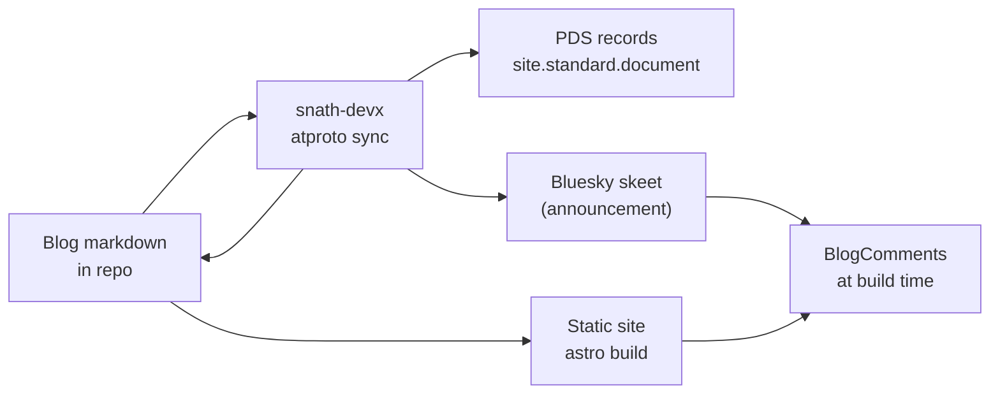

# AT Protocol for devx Astro sites

Connect an **Astro 6** static site (GitHub Pages, [devx-template](https://github.com/scottnath/devx-template) shape) to the [ATmosphere](https://atproto.com/): publish long-form posts as [standard.site](https://standard.site/) documents, optionally announce them on Bluesky, and show federated comment threads on your blog pages.

Implementation lives in `@scottnath/devx` — CLI plus a small library on `@atproto/api`. Site-specific layout and content schema live in the template repo.

For research, tooling comparisons, and why we built it this way, see [history/atproto.md](history/atproto.md).

---

## Glossary

| Term | Meaning |
|------|---------|
| **Handle** | Public name (e.g. `slacktivist.com`) — verified via DNS |
| **DID** | Permanent identity (e.g. `did:plc:…`) |
| **PDS** | Where your records live (for many Bluesky users: Bluesky-hosted, not your web server) |
| **standard.site** | Lexicons for long-form: `site.standard.publication`, `site.standard.document` |
| **Your Astro site** | Static HTML on GitHub Pages — separate from the PDS |

Publishing to the atmosphere means writing **records on your PDS**. The website and the PDS are linked by verification (`.well-known`, `<link>` tags), not by being the same server.

---

## Overview



**Source of truth for articles:** markdown in `src/content/blog/`.

1. Write posts locally (skip `draft: true` when ready to publish).
2. Run **`snath-devx atproto sync`** (locally or in CI) — creates/updates PDS documents, optionally posts a Bluesky announcement, writes sync state and frontmatter.
3. **`astro build`** — static site with verification tags and federated comments on posts that have a `bskyPostUri`.

---

## What devx ships

| Artifact | Purpose |
|----------|---------|
| `snath-devx atproto sync` | CLI — publish, dry-run, force, single-post, delete |
| `@scottnath/devx/atproto` | `fetchComments`, `countComments`, `generateDocumentLinkTag`, types |
| `devx-template` | `BlogPost.astro`, `BlogComments.astro`, blog content schema, CI hooks |

**Dependency:** `@atproto/api` only (via devx). No third-party Astro ATProto packages.

**State files:** `atproto-state.json`, `atproto-syndication.json` (gitignored locally; CI may commit them). Sync writes `atprotoUri`, `atprotoRkey`, and `bskyPostUri` to post frontmatter.

---

## Setup checklist

1. [ ] `public/.well-known/atproto-did` — plain DID line for domain identity
2. [ ] `atproto.config.ts` — copy from [atproto.config.example.ts](atproto-examples/atproto.config.example.ts)
3. [ ] Blog collection — see [content.config.example.ts](atproto-examples/content.config.example.ts)
4. [ ] `BlogPost.astro` + `BlogComments.astro` — copy from devx-template
5. [ ] Credentials — `ATPROTO_APP_PASSWORD`, `ATP_IDENTIFIER` (env or `.env`)
6. [ ] GitHub Actions secrets for CI sync — see [atproto-publish.workflow.snippet.yml](atproto-examples/atproto-publish.workflow.snippet.yml)
7. [ ] GitHub Pages: `include-hidden-files: 'true'` on `upload-pages-artifact` so `.well-known` deploys
8. [ ] Verify: [pdsls.dev](https://pdsls.dev/) for records; resolve handle via public API

Check handle: `curl 'https://public.api.bsky.app/xrpc/com.atproto.identity.resolveHandle?handle=YOUR_HANDLE'`

---

## Configuration

### `atproto.config.ts`

Copy [atproto.config.example.ts](atproto-examples/atproto.config.example.ts). Key fields:

| Field | Purpose |
|-------|---------|
| `siteUrl` | Canonical site URL (used in published markdown links) |
| `identifier` | Handle or DID; falls back to `ATP_IDENTIFIER` env |
| `contentDir` | Blog markdown directory |
| `postPathPrefix` | URL prefix, e.g. `/blog` |
| `publication` | Name and description for `site.standard.publication` |

On first sync, devx ensures the publication record exists and writes `public/.well-known/site.standard.publication`.

### Environment variables

Loaded from the process environment and from `.env` in the project root ([dotenv](https://www.npmjs.com/package/dotenv)).

| Variable | Purpose |
|----------|---------|
| `ATPROTO_APP_PASSWORD` | [App password](https://bsky.app/settings/app-passwords) for sync |
| `ATP_IDENTIFIER` | Handle or DID (e.g. `slacktivist.com`) |
| `BLUESKY_CROSSPOST` | Set to `0` to disable Bluesky announcement skeets |

### Blog frontmatter

After sync, these fields may be written automatically:

| Field | Purpose |
|-------|---------|
| `atprotoUri` | AT-URI of the `site.standard.document` |
| `atprotoRkey` | Document record key (stable verification) |
| `bskyPostUri` | Announcement skeet URI (for federated comments) |
| `crosspost: false` | Opt out of Bluesky announcement for one post |
| `ogImage` | Local path for embed thumbnail (e.g. `public/images/post.png`); falls back to `defaultOgPath` in config |
| `draft: true` | Skipped by sync |

---

## Site integration

### Content collection

```ts
import { defineCollection } from 'astro:content';
import { glob } from 'astro/loaders';
import { z } from 'astro/zod';

const blog = defineCollection({
  loader: glob({ pattern: '**/*.{md,mdx}', base: './src/content/blog' }),
  schema: z.object({
    title: z.string(),
    description: z.string().optional(),
    date: z.coerce.date(),
    draft: z.boolean().optional(),
    tags: z.array(z.string()).optional(),
    atprotoUri: z.string().optional(),
    atprotoRkey: z.string().optional(),
    bskyPostUri: z.string().optional(),
    crosspost: z.boolean().optional(),
  }),
});
```

### Post layout — document verification

```astro
---
import { generateDocumentLinkTag } from '@scottnath/devx/atproto';
const linkTag = entry.data.atprotoRkey && did
  ? generateDocumentLinkTag(did, entry.data.atprotoRkey)
  : null;
---
<Fragment slot="head">
  {linkTag && <Fragment set:html={linkTag} />}
</Fragment>
```

Base layout needs `<slot name="head" />` in `<head>`.

### Federated comments

`BlogComments.astro` in the site template imports `fetchComments` from `@scottnath/devx/atproto`. Requires `bskyPostUri` in frontmatter (written by sync). Rebuild the site to refresh threads after new replies.

Each published post gets a Bluesky **announcement skeet** (title + description + link). Replies on that skeet are the comment thread.

---

## CLI

```bash
# Publish (or update) all non-draft posts
npx snath-devx atproto sync

# Preview without writing
npx snath-devx atproto sync --dry-run

# Re-publish everything
npx snath-devx atproto sync --force

# Single post
npx snath-devx atproto sync --post my-slug

# Custom config path
npx snath-devx atproto sync -c atproto.config.ts
```

**Consumer `package.json`:**

```json
"sync:atproto": "snath-devx atproto sync",
"sync:atproto:dry-run": "snath-devx atproto sync --dry-run"
```

In the devx repo itself (cannot invoke its own bin symlink during development):

```json
"sync:atproto": "node --import tsx cli/index.ts atproto sync"
```

---

## CI/CD

Merge [atproto-publish.workflow.snippet.yml](atproto-examples/atproto-publish.workflow.snippet.yml) into your Publish workflow.

Typical order: **sync → commit state/frontmatter → build → deploy**.

Secrets: `ATPROTO_APP_PASSWORD`, `ATP_IDENTIFIER`. Optional variable: `BLUESKY_CROSSPOST`.

Commit bot should use `[skip ci]` on state commits. Node `>=24`.

---

## Images

| Image type | Where it lives | Bluesky embed |
|------------|----------------|---------------|
| Inline in blog markdown | `public/images/` on site | — |
| Per-post embed thumb | Frontmatter `ogImage` (e.g. `public/images/post.png`) | Uploaded on announcement |
| Site default embed thumb | `defaultOgPath` in `atproto.config.ts` | Used when post has no `ogImage` |

Prefer stable `public/images/…` paths over hashed `/_astro/…` URLs in markdown sent to the PDS.

---

## Links

- [standard.site](https://standard.site/)
- [ATProto docs](https://atproto.com/)
- [Astro v6 upgrade guide](https://docs.astro.build/en/guides/upgrade-to/v6/)
- [Design history & tooling survey](history/atproto.md)
