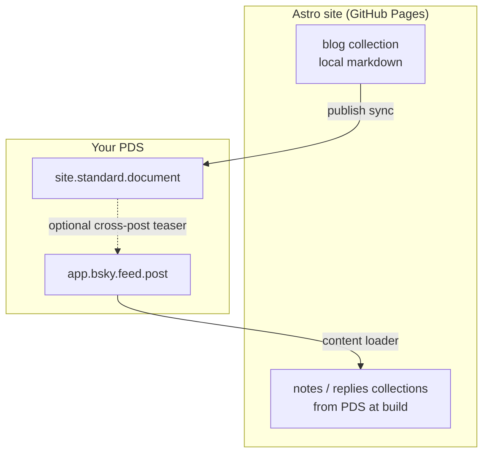

# AT Protocol — design history

How we got to the current devx ATProto implementation. Read this before proposing alternate stacks or re-surveying the ecosystem.

**Current implementation:** [../atproto.md](../atproto.md)

---

## Original goal

Connect **Astro-managed static sites** (GitHub Pages, devx-template shape) to the [ATmosphere](https://atproto.com/) — with [standard.site](https://standard.site/) for long-form publishing and Bluesky (`app.bsky.feed.*`) for social records.

Early doc treated this as a **future devx preset**: scripts, content schemas, CI snippets, and a choice of npm packages to compose. That exploration is captured below. The shipped product is narrower: owned sync + comments on `@atproto/api`, template-owned UI.

---

## Architecture we explored

Two directions came up repeatedly. They are **features**, not separate products — we shipped the publish path first.



### Publish out (shipped)

**Source of truth:** markdown in the repo.

1. Write posts in Astro (`src/content/blog/` or equivalent).
2. CI (or local) runs sync → creates/updates `site.standard.document` on your PDS.
3. `astro build` → static site with verification tags and federated comments.

Long-form lives on the PDS as standard.site records; images in posts stay on your site as stable URLs (`public/images/…`).

### Ingest in (not shipped)

**Source of truth:** records already on your PDS (Bluesky for now).

1. You post or reply on Bluesky → `app.bsky.feed.post` in **your** repo.
2. At **build time**, a content loader pulls selected records into Astro collections.
3. Static pages render notes, replies, threads, etc.

This is **not** Leaflet ingest. You are not importing essays from another writing app. You are displaying **your social graph activity** (skeets, replies, quotes) on your own site.

Ingest does **not** replace publish for long articles. If both exist later, they need dedupe rules (see [Avoiding duplicates](#avoiding-duplicates)).

---

## Ecosystem: Astro integrations

Surveyed packages listed on [Astro integrations — search: atproto](https://astro.build/integrations/?search=atproto).

| Package | Job | Direction | Astro 6 | Notes |
|---------|-----|-----------|---------|-------|
| [@bryanguffey/astro-standard-site](https://www.npmjs.com/package/@bryanguffey/astro-standard-site) | Publish, comments, verify | Write (+ basic read) | Partial — loader broken on v6 in npm 1.0.3 | Publish path candidate |
| [at-astro-loader](https://github.com/chrisvander/at-astro-loader) | Typed lexicon loader + renderers | Read | Yes (`^6.1.8`) | Any lexicon; Leaflet/Pckt render |
| [@fujocoded/astro-atproto-loader](https://www.npmjs.com/package/@fujocoded/astro-atproto-loader) | Flexible record loader | Read | Yes (`^5.13 \|\| ^6`) | Bluesky posts, `fetchRecord`, blobs |
| [@dylmye/atproto-standard-site-astro-loader](https://www.npmjs.com/package/@dylmye/atproto-standard-site-astro-loader) | standard.site ingest only | Read | Yes (`>=6`) | Early; Bluesky-first ingest made this lower priority |
| [@fujocoded/authproto](https://www.npmjs.com/package/@fujocoded/authproto) | Visitor OAuth login | Auth | Yes | Guestbooks, SSR apps — not static blog ingest |

**Sequoia** ([sequoia.pub](https://sequoia.pub/)) is a CLI alternative for publish (framework-agnostic). Early plan was to document it as an option; we implemented our own sync on `@atproto/api` instead of composing **astro-standard-site**.

### Capability gaps (at time of survey)

Nothing in the ecosystem shipped all of this out of the box:

| Capability | Sequoia | astro-standard-site | devx (planned → shipped) |
|------------|---------|---------------------|--------------------------|
| Publish posts → PDS | CLI | Library + example script | `snath-devx atproto sync` |
| State / change tracking | `.sequoia-state.json` | Frontmatter / script | `atproto-state.json` |
| Dry-run | Yes | In repo script only | Yes |
| Bluesky auto-announce | Config flag | No | Optional env flag |
| Federated comments on blog | Web component | `Comments.astro` | Template `BlogComments.astro` + devx `fetchComments` |
| Ingest Bluesky posts/replies | N/A | Wrong loader | Not shipped — fujocoded / at-astro-loader candidates |
| Static GitHub Pages | Yes | Yes | Yes |

### Reference implementations we studied

- Publish + CI + state + optional crosspost: [benswift/benswift.github.io](https://github.com/benswift/benswift.github.io) (`scripts/atproto-publish.ts`, not astro-standard-site)
- Sync script with dry-run: [musicjunkieg/astro-standard-site/scripts/sync-to-atproto.ts](https://github.com/musicjunkieg/astro-standard-site/blob/main/scripts/sync-to-atproto.ts)
- Jekyll publish + CI + `.well-known` on Pages: [andrew/jekyll-standard-site](https://github.com/andrew/jekyll-standard-site)

---

## Decision: owned code on `@atproto/api`

We did **not** take a dependency on third-party Astro ATProto packages. devx owns:

- Sync CLI (`snath-devx atproto sync`)
- PDS client, state, frontmatter updates, Bluesky announcement
- Comment fetch at build time
- Verification helpers

Site template owns Astro UI (`BlogPost.astro`, `BlogComments.astro`, content schema). Rationale: fewer moving parts, Astro 6 compatibility under our control, one place to fix lexicon drift.

---

## Requirements spec (by layer)

Original layered checklist used during design. Layers 0–5 and 7 map to what shipped; **Layer 6 (ingest) was deferred**.

### Layer 0 — Identity

| Requirement | Implementation |
|-------------|----------------|
| ATProto account | Bluesky (or any PDS) + [app password](https://bsky.app/settings/app-passwords) for CI |
| Domain handle | DNS + `public/.well-known/atproto-did` (plain DID) |

### Layer 1 — Publication

| Requirement | Implementation |
|-------------|----------------|
| `site.standard.publication` on PDS | Created on first sync if missing |
| `/.well-known/site.standard.publication` | Static file: single line, publication AT-URI |
| Optional discovery hint | `<link rel="site.standard.publication" href="at://…">` in site layout |

### Layer 2 — Document publishing

| Requirement | Implementation |
|-------------|----------------|
| Content source | Astro 6: `src/content.config.ts` + `glob()` loader for `src/content/blog/**` |
| Transform | Markdown + plain text for `site.standard.document` |
| Stable image URLs | Prefer `public/images/…` over hashed `/_astro/…` paths |
| Publish | `snath-devx atproto sync` — create/update documents |
| Idempotency | State file and/or frontmatter `atprotoUri` / `atprotoRkey` |
| Change detection | Content hashes |
| Drafts | Skip `draft: true` in frontmatter |

### Layer 3 — Document verification

| Requirement | Implementation |
|-------------|----------------|
| Per-post `<link rel="site.standard.document" href="at://…">` | Post layout `<head>` from frontmatter |
| Helpers | `generateDocumentLinkTag()` from `@scottnath/devx/atproto` |

### Layer 4 — Bluesky announcement

Every published post gets a Bluesky **announcement skeet** (title + description + link). Replies on that skeet are the comment thread on the blog page.

| Requirement | Implementation |
|-------------|----------------|
| Teaser post | Title + description + URL (~300 chars), not full article |
| `bskyPostRef` on document | Links PDS document to the announcement skeet |
| Default | On for all non-draft posts; opt out with frontmatter `crosspost: false` |
| Disable all | Env `BLUESKY_CROSSPOST=0` |
| Thumbnail | Optional `defaultOgPath` in `atproto.config.ts` |

### Layer 5 — Federated comments

| Requirement | Implementation |
|-------------|----------------|
| Bluesky announcement per article | Layer 4, default on |
| `bskyPostUri` in frontmatter | Written by sync after announcement |
| UI | `BlogComments.astro` in site template |
| Refresh | Rebuild site when new replies appear |

Comments show **replies on your article’s skeet**, not a site section of all your reply-posts.

### Layer 6 — Atmosphere ingest (deferred)

| Requirement | Candidate approach |
|-------------|-------------------|
| Loader | `@fujocoded/astro-atproto-loader` or `at-astro-loader` |
| Collection | `app.bsky.feed.post` from your handle/DID |
| Split collections | `notes` (top-level), `replies` (with parent hydration) |
| Media | `toHostedBlob()` (fujocoded) for avatar/embed images |
| Filter | Exclude cross-post teasers that duplicate published articles |

**Explicitly out of scope for v1:** ingesting other people’s top-level posts as site content; SSR live collections; Leaflet long-form ingest.

Example `notes` collection shape (fujocoded loader — not implemented in devx):

```ts
import { defineAtProtoCollection } from '@fujocoded/astro-atproto-loader';
import { z } from 'astro/zod';

const notes = defineAtProtoCollection({
  source: {
    repo: 'slacktivist.com',
    collection: 'app.bsky.feed.post',
    limit: 100,
  },
  transform: ({ value, uri, rkey }) => {
    const v = value as { text?: string; reply?: unknown };
    if (v.reply) return undefined;
    return { id: rkey, data: { uri, text: v.text ?? '' } };
  },
  outputSchema: z.object({
    uri: z.string(),
    text: z.string(),
  }),
});
```

### Layer 7 — Operations (CI/CD)

| Requirement | Implementation |
|-------------|----------------|
| Secrets | `ATPROTO_APP_PASSWORD`, `ATP_IDENTIFIER` in GitHub Actions |
| Order | Publish → commit state → build → deploy |
| State commit-back | `[skip ci]` + bot guard |
| GitHub Pages `.well-known` | `include-hidden-files: 'true'` on upload artifact |
| Node | `>=24` (devx standard) |

---

## Avoiding duplicates

If ingest is added later alongside publish:

| Content | Rule |
|---------|------|
| Long article written in Astro | Publish `site.standard.document`; do not show cross-post skeet in `notes` |
| Skeet-only thought | Ingest only; no local markdown |
| Reply on someone else's post | `replies` collection; hydrate parent |
| Article + Bluesky teaser | Document on PDS + skeet with link; comments via `bskyPostUri` |

Dedupe tactics considered:

- Track syndicated skeet URIs in `atproto-state.json` or `atproto-syndication.json`
- Filter `notes` where `text` matches canonical blog URL pattern
- Exclude records that already have a matching `site.standard.document` path

---

## Images (full survey)

| Image type | Where it lives | Atmosphere |
|------------|----------------|------------|
| Inline in blog markdown | `public/images/` on site | Published markdown uses absolute URLs to your domain |
| Cover / OG | Frontmatter + `public/` or assets | Optional blob on PDS (`coverImage`) — Sequoia does this; not in devx v1 |
| Bluesky embed thumb | Local hero/OG file | Uploaded or linked in crosspost embed only |
| Avatars/media in ingested skeets | PDS blobs | `toHostedBlob()` at build time (ingest path only) |

---

## Links

- [standard.site](https://standard.site/)
- [ATProto docs](https://atproto.com/)
- [Astro integrations: atproto](https://astro.build/integrations/?search=atproto)
- [Sequoia publishing](https://sequoia.pub/publishing)
