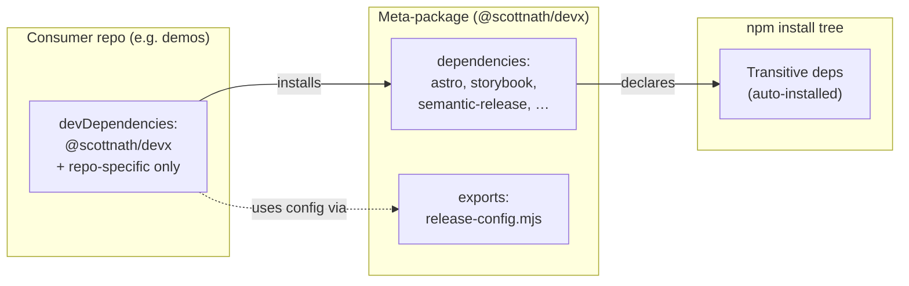
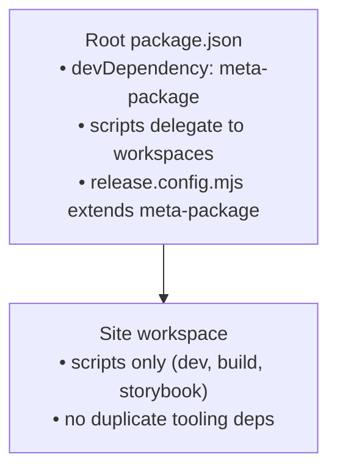
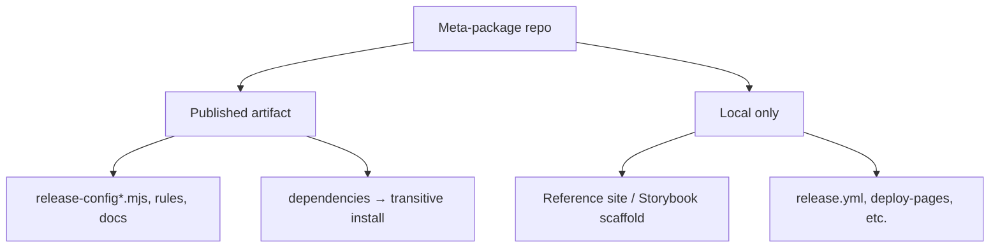

# Meta-package pattern

A **meta-package** is a small published npm package whose job is to **standardize tooling across repos** — not to ship app code. Consumers install one package; npm installs the rest transitively.

`@scottnath/devx` is the reference implementation.

---

## What it is (one sentence)

A meta-package **bundles shared config + shared dependencies** so every consumer repo gets the same toolchain versions and conventions from a single `devDependency`.

---

## What gets published vs what stays local

| Published to registry | Stays in the meta-package repo only |
|---------------------|-------------------------------------|
| Config modules (`exports` in `package.json`) | Reference/demo apps (e.g. `astro/` workspace) |
| Docs, scripts, presets | CI for the meta-package itself |
| Declared `dependencies` (install transitively) | Built Storybook static output |

**Rule:** If consumers need to `import` or `extends` it, publish it. If it’s only proof the stack works, keep it local.

---

## Dependency model



### Where deps live

| Field | Use for |
|-------|---------|
| **`dependencies`** (in meta-package) | Tooling every consumer needs — Astro, Storybook, semantic-release plugins, etc. Installs **transitively** when consumer adds the meta-package. |
| **`devDependencies`** (in consumer) | Things **specific to that repo** only — e.g. `typescript` if you choose not to bundle it, test runners, app-only libs. |
| **`dependencies`** (in consumer workspace packages) | Usually **avoid** — scripts-only `package.json` in site workspaces; tools come from the root meta-package. |

**Design choice:** Decide explicitly what is transitive vs per-repo. Document it in the meta-package README.

---

## Config as the product

The meta-package’s real API is **config modules**, not runtime code:

```javascript
// consumer release.config.mjs
export default { extends: '@scottnath/devx' };        // GitHub release only
export default { extends: '@scottnath/devx/npm' };   // + GitHub Packages publish
```

Same pattern works for ESLint, TS bases, Storybook presets — **export presets; consumer extends them**.

---

## Consumer repo shape



Minimal consumer checklist:

1. `.npmrc` scope → registry (if using GitHub Packages)
2. `devDependencies`: meta-package + repo-only deps
3. `release.config.mjs` (or equivalent) extends meta-package preset
4. Workspaces: **scripts only** in site packages; tools at root
5. CI: auth for private registry + same Node version (`.nvmrc`)

---

## What the meta-package repo contains



Reference site (devx `astro/`) is **living documentation** — copy patterns into consumers; don’t publish it as part of the npm package (`files` field controls this).

---

## Creating a new meta-package (checklist)

1. **Name** — scoped package (`@org/toolkit`)
2. **`exports`** — one entry per preset (`./`, `./npm`, `./eslint`, …)
3. **`dependencies`** — full toolchain you want shared
4. **`files`** — only config, docs, scripts (not demo apps)
5. **`publishConfig.registry`** — npm or GitHub Packages
6. **Release** — semantic-release preset that publishes the meta-package itself
7. **README** — install, `.npmrc`, consumer `package.json` template, copy-paste configs
8. **Reference project** — optional workspace proving the stack runs

---

## devx in one glance

| Piece | Role |
|-------|------|
| `@scottnath/devx` | Meta-package on GitHub Packages |
| `dependencies` | Astro, Storybook, semantic-release stack |
| `exports` | Gitmoji release presets (`/`, `/npm`) |
| `astro/` workspace | Reference site + Storybook; not published |
| Consumer `demos` | `devDependencies: @scottnath/devx`, scripts-only `astro/` workspace |

**Goal:** change tooling once in devx → bump version → consumers upgrade one dependency.
